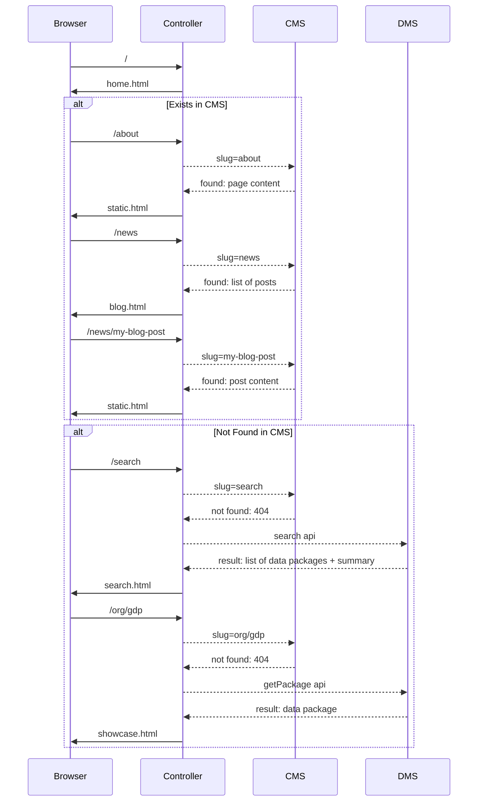

CKAN frontend in node.js.

[](https://travis-ci.org/datopian/frontend-v2)
[](https://coveralls.io/github/datopian/frontend-v2?branch=master)

## Quick Start

Tested on NodeJS v8.10.0.

Clone the repo, install dependencies using yarn (or npm) and run the server:

```bash
yarn
yarn start
```
or
```bash
npm install
npm start
```

You can also run the app in development mode which automatically loads your changes to JS files and templates:

```bash
yarn dev
```
or
```bash
npm run dev
```

## Set up your own backend

*By default, the app runs against mocked API so you don't need to setup your own backend.*

To change environment variables, you can rename `env.template` as `.env` and set the values. To unmock backends, you need to set `NODE_ENV` environment variable, e.g., `NODE_ENV=staging`.

### DMS

Setup `API_URL` environment variable so it points to your CKAN instance, e.g., for demo.ckan.org it would be:

```
export API_URL=https://demo.ckan.org/api/3/action/
```

### CMS

You can use one of built-in CMS plugins - check it out below.

#### Wordpress

Read about WordPress plugin here: https://github.com/datopian/frontend-v2/blob/master/plugins/wp/README.md

#### CKAN Pages

To use CKAN Pages as your CMS backend, add it to your list of `PLUGINS` in `.env` file:

```
PLUGINS=ckan_pages
```

When enabled, CKAN Pages plugin will use the CKAN `API_URL` environment variable by default.
To configure a different URL for your CKAN Pages backend add `CKAN_PAGES_URL=https://yourckan.com/api/3/action/` to your environment.

For more info about enabling and using CKAN Pages - https://github.com/ckan/ckanext-pages

## API

*All of the controller and views use the API module - they don’t see backend.*

We have separated API module into `DmsModel` and `CmsModel`. The former part talks to CKAN (or can be any DMS), while the latter fetches content for static pages, for example, it can be WordPress. Below is the flow of how it works together:



If above doesn't render, here is the screenshot:


## Routes

Here is the summary of existing routes at the moment:

* Home: `/`
* Search: `/search`
  * with query: `/search?q=gdp`
* Showcase: `/organization/dataset`
* Organization: `/my_org`
  * It gets redirected from CKAN like path: `/organization/my_org`
* Collections: `/collections`
  * It gets redirected from CKAN groups page: `/group`
* CMS:
  * About: `/about`
  * Blog: `/news`
  * Post: `/news/my-post`
  * Anything else: `/foo/bar`

## Extensions

The platform can be extended in the following ways:

### Theme

Your theme needs an `index.js` file which defines a `module.export` function that receives the express `app` object. Use `app` to add routes, middleware, etc, to the frontend app.

When your theme is enabled, the `index.js` file will be executed by the app.

*NOTE* You do not need to return anything from this function, just extend the app object by reference.

And in `/themes/your_cool_theme/index.js`:
```
module.exports = function (app) {
  // extend the express app object as you see fit
  // for example, add a route /foo
  app.get('/foo', (req, res) => {
    res.render('example.html', {
      title: 'Example Theme route',
      content: {foo: 'Hello theme route'}
    })  
  })  
}
```

#### NPM
Themes can be loaded via npm:

```
$ yarn add your_ckan_ng_theme
```

And in `.env`
```
THEME=your_ckan_ng_theme
THEME_DIR=node_modules
```

> *NOTE*: Make sure to set `THEME_DIR` to `node_modules`!!!

### Plugins

#### User Defined Plugins

Users can define plugins.

Create a directory with the plugins name in `/plugins`
Add an `index.js` file that uses the app object, as in `theme routes` above.

Add the plugin name to your `.env` file (or to your node environment via any available method). Separate multiple plugins with a space:
`PLUGINS=your_cool_plugin`

For example, we will create a `req_parameter_logger` plugin:

`plugins/req_parameter_logger/index.js`
```
module.exports = function(app) {
  app.use((req, res, next) => {
    console.log("EXAMPLE PLUGIN LOGGER {req query}:", req.query)
    next()
  })  
}
```

Add the plugin name to your .env file.
Now when we can run `$ yarn start`

Our plugin will be loaded:

```
Loading configured plugins...
Loading configured theme routes...
Listening on :4000
```

If we visit `localhost:4000?q=123&q1=12451`we will see the following in our console:

```
EXAMPLE PLUGIN LOGGER {req query}: { q: '123', q1: '12451' }
EXAMPLE PLUGIN LOGGER {req query}: {}
```

#### NPM Plugins

If an express middleware plugin is available as a standalone module on npm you can install it as-is by installing the package via npm, and adding it to your `PLUGINS` variable in `.env`

For example, we will install the cookie-parser plugin, alongside our example.

in `.env`:
`PLUGINS="example cookie-parser"`

now install the npm package:
`$ yarn add cookie-parser`

Cookie-parser will now be applied to all of your requests as express middleware!

(For instance, you could take advantage of this in custom routes, etc)

For more on express middleware: https://expressjs.com/en/guide/using-middleware.html

#### Google analytics plugin

To add Google Analytics tracking code to page templates,
enable the plugin in your `.env` file:

```bash
PLUGINS="... google-analytics ..."
GA_ID=UA-000000000-0
```

#### Mailer plugin

To enable mailer plugin, you need to update your `.env` as following:

```
PLUGINS="... mailer ..."
SMTP_SERVICE=gmail (optional if you have host and port details)
SMTP_HOST=smtp.example.com (optional if you set 'SMTP_SERVICE')
SMTP_PORT=587 (optional if you set 'SMTP_SERVICE')
EMAIL_FROM=from@example.com
EMAIL_PASSWORD=*****
EMAIL_TO=to@example.com
```

Here is the list of well-known services that can be used without setting host and port of your SMTP server: [Supported services](https://nodemailer.com/smtp/well-known/#supported-services).

Then you need to implement `contact.html` template in your theme so that a contact form can be rendered at `/contact`.

## Tests

Set `.env` to hit mocked services:

```bash
API_URL=http://127.0.0.1:5000/api/3/action/
WP_URL=http://127.0.0.1:6000
```

Run tests:
```bash
yarn test

# watch mode:
yarn test:watch
```

## Deployment

*You can deploy this app to any host that supports NodeJS.*

### Zeit Now

Read the docs - https://zeit.co/examples/nodejs

Suggested config file (`now.json`):

```json
{
  "version": 2,
  "builds": [
    {
      "src": "index.js",
      "use": "@now/node-server",
      "config": { "maxLambdaSize": "50mb" }
    }
  ],
  "env": {
    "NODE_ENV": "development"
  },
  "routes": [
    {
      "src": "/(.*)",
      "dest": "/index.js"
    }
  ]
}
```

### Heroku

Read the docs about Deployment of NodeJS apps on Heroku - https://devcenter.heroku.com/articles/deploying-nodejs.

## Theming

By default, the frontend app uses DataHub theme which contains of templates (`/views/`) and assets (`/public/`).

If you need to customize the design of the site, you can create your own theme in the `/themes/` directory. E.g., we can create a theme called `example` with `public` and `views` directories so that they override default assets in `/public/` and templates in `/views/`:

```
/themes/example/public
/themes/example/views
```

To start using created template you need to set `THEME` environment variable to your theme name (you also can do it via `.env` file):

```
export THEME=example
```

---
**NOTE**

The default assets and templates are used, if a file isn't found in your theme. This allows you to change specific part of the templates or assets.

---

### Variables available in each page

#### Macros (helpers)

All default macros are located at `/views/_snippets.html`.

Importing macros in a template:

```html

```

Use it:

```html
{{ snippets.package_list_show(packages) }}
```

##### List data packages

Example on search page:


* Macros: `package_list_show`
* Parameters:
  * list of data packages
* Returns: list of HTML elements. Each element is sort of a summary card for a data package.

##### List data package licenses or sources

Example:


* Macros: `listify`
* Parameters:
  * list of standard data package licenses or sources
* Returns: HTML anchor tag or span element

#### Home page

Bespoke ...

#### Search page

```javascript
{
  title: 'Search',
  result: [list of data packages],
  query: {q: '', size: '', from: '', sort: ''},
  pages: [list of pages to display in pagination]
}
```

#### Showcase page

```javascript
{
  title: ...,
  dataset: datapackage, // a standard data package ...
  owner: {
    name: "rufuspollock"
    title: "Rufus Pollock",
    avatar: "...." // url to image for this
    route: "/rufuspollock",
  }
}
```

In standard Data package we have `created` and `modified` fields which is a timestamp and it isn't human readable (`2019-01-01 00:00:00`). We want to show it as `January 1, 2019`. The easiest would be to convert in controller and pass it through. E.g., in template if you access `dataset.created` it would print nicely formatted date.

#### Organization page

```javascript
{
  // org
  title: 'owner name',
  owner (name): 'owner name',
  description: 'description from profile',
  avatar: 'url to image',
  joinDate: 'eg, June 2019',

  // misc ...
  result: [list of data packages],
  query: {q: '', size: '', from: '', sort: ''},
  pages: [list of pages to display in pagination]
}
```

#### Collections page

List of collections page.

```javascript
{
  title: 'Dataset Collections',
  description: 'Catalogue of datasets ...',
  collections: [
    {
      name: '',
      title: '',
      summary: '',
      image: ''
    },
    ... // more collection objects
  ]
}
```

#### Individual collection page

```javascript
{
  title: 'title of collection',
  item: {
    name: '',
    title: '',
    summary: '',
    image: ''
  },

  // Misc
  result: [list of data packages],
  query: {q: '', size: '', from: '', sort: ''},
  pages: [list of pages to display in pagination]
}
```

#### Blog

List of posts.

```javascript
{
  posts: [{post}, ...]
}
```

``{post}`` object is a WP post object containing all available metadata. Below is main stuff that we use:

```javascript
{
  title: '',
  slug: '',
  content: '',
  date: ''
  modified: ''
}
```

#### Article / post page

```javascript
{
  title: '',
  content: '',
  published: 'formatted published date',
  modified: 'formatted modified date'
}
```

### i18n

#### Configure

Define location of translation files. We recommend creating `i18n` directory in your theme:

```
TRANSLATIONS=/themes/example/i18n
```

List of available locales then auto detected by filenames.

Use `defaultLocale` cookie to set the site's locale. E.g., if `defaultLocale=en`, then `/themes/example/i18n/en.json` file is used.

#### i18n of the site

In your templates:

```html
{{ __('Hello world!') }}
{{ __('Hi %s', 'you') }} // Hi you
{{ __('Hi {{ name }}', { name: 'you' }) }} // Hi you
```

This will add a phrase/word to your translation file if it is unknown.

Plurals translation:

```html
{{ __n('%s dog', 1) }} // 1 dog
{{ __n('%s dog', 3) }} // 3 dogs
```

In your translation file:

```json
{
  "%s dog": {
    "one": "%s dog",
    "other": "%s dogs"
  }
}
```

#### i18n of the content

You can have a page in WordPress with the same slug as original page plus locale at the end. E.g., for `/about` page we would have two pages on WP, `about` (English) and `about-da` (Danish). When fetching a content we can check the user's locale and get content in his/her language.
