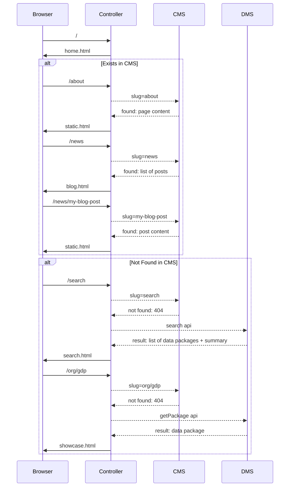

CKAN frontend in node.js.

[](https://travis-ci.org/datopian/frontend-v2)
[](https://coveralls.io/github/datopian/frontend-v2?branch=master)

## Quick Start

Tested on NodeJS v8.10.0.

Clone the repo, install dependencies using yarn (or npm) and run the server:

```bash
yarn
yarn start
```

To run and watch HTML:

```bash
# note the -e which means we watch for changes in templates too
nodemon -e "js html" index.js
```

To run and watch everything:

```bash
npx gulp
```

This runs the server and watches for changes to CSS and icons. On changes to CSS [PostCSS](https://postcss.org/) and plugins ([postcss-import](https://github.com/postcss/postcss-import), [postcss-preset-env](https://preset-env.cssdb.org/), [tailwindcss](https://tailwindcss.com), [cssnano](https://cssnano.co/)) are run. On icon changes, the SVG icon sprite is remade. These processes can be run without watching via `npx gulp css` and `npx gulp icons`.

Icons are used like so: `<svg><use xlink:href="#<filename>" /></svg>`. Eg. to use the search.svg icon, you use `<svg><use xlink:href="#search" /></svg>`.

Note: Unless you are making significant changes to the design, you probably won't need these processes. Most styling is done through [Tailwind's](https://tailwindcss.com) utility classes.

## Set up your own backend

*By default, the app runs against mocked API so you don't need to setup your own backend.*

To change environment variables, you can rename `env.template` as `.env` and set the values.

### DMS

Setup `API_URL` environment variable so it points to your CKAN instance, e.g., for demo.ckan.org it would be:

```
export API_URL=https://demo.ckan.org/api/3/action/
```

### CMS

Use `WP_URL` environment variable to point to your WordPress instance. For example, we have test wordpress blog here https://edscms.home.blog/ so it would be:

```
export WP_URL=https://edscms.home.blog/
```

## API

*All of the controller and views use the API module - they don’t see backend.*

We have separated API module into `DmsModel` and `CmsModel`. The former part talks to CKAN (or can be any DMS), while the latter fetches content for static pages, for example, it can be WordPress. Below is the flow of how it works together:



If above doesn't render, here is the screenshot:


## Routes

Here is the summary of existing routes at the moment:

* Home: `/`
* Search: `/search`
  * with query: `/search?q=gdp`
* Showcase: `/organization/dataset`
* CMS:
  * About: `/about`
  * Blog: `/news`
  * Post: `/news/my-post`
  * Anything else: `/foo/bar`

## Tests

Run tests (note that tests are running against mocked API_URL set to http://127.0.0.1:5000/api/3/action/):

```bash
yarn test

# watch mode:
yarn test:watch
```
