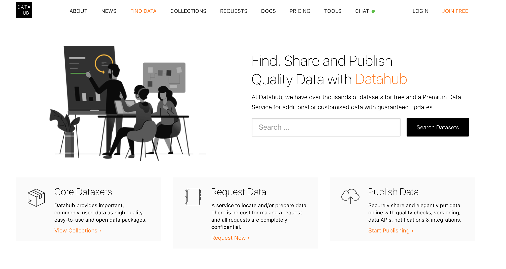
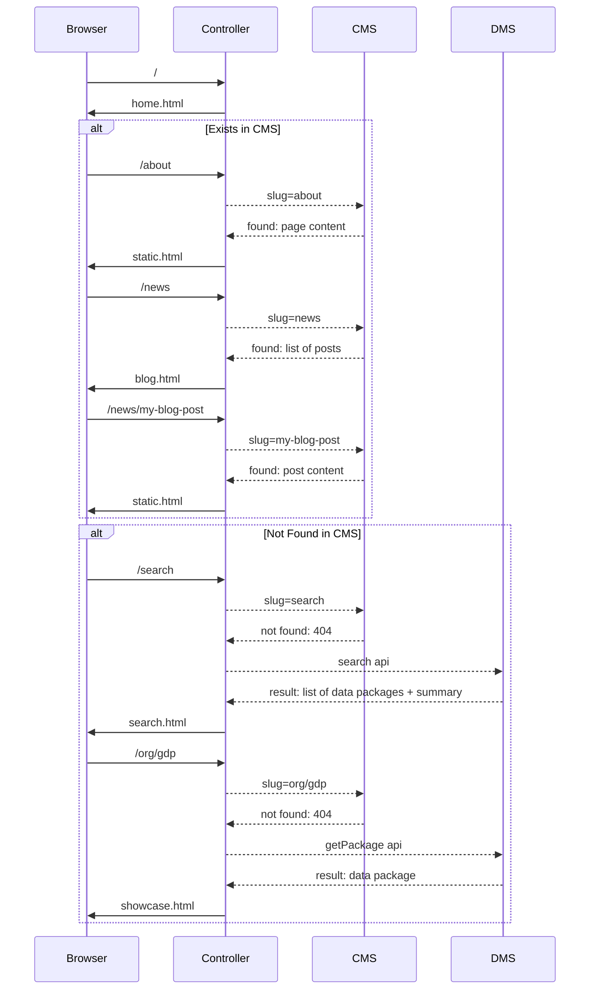

Data Portal frontend. Designed for CKAN but usable anywhere. Microservice architecture so you can run and customize it standalone and connect to your backend of choice. Built in pure Javascript (Node).

<div align="center">

## 📣 Announcing Portal.js 🌀
### [Portal.js] 🌀 is a javascript framework for building rich data portal frontends fast<br/><br/>using a modern frontend approach (JavaScript, React, SSR).

### 👉 https://github.com/datopian/portal.js

### Next step in the evolution of this codebase

</div>

[Portal.js]: https://github.com/datopian/portal.js

[](https://travis-ci.org/datopian/frontend-v2)
[](https://coveralls.io/github/datopian/frontend-v2?branch=master)

## Installation

Requires node.js v8.10.0 or later

Clone the repo:

```bash
$ git clone https://github.com/datopian/frontend-v2.git
```

Install project dependencies:

```bash
$ cd frontend-v2
$ yarn # or you can use `npm i`
```

You can now run the frontend app in dev mode:

```bash
$ yarn dev # or `npm run dev`
```

Open a browser and navigate to http://localhost:4000. If everything went correctly you should see the *CKAN NG* frontend app!

> 

Now navigate to http://localhost:4000/search and you should see the data catalog - these are mocked at the moment. Let's now unmock it and use demo CKAN instance. To do that we need to change DMS API configuration. First stop the server and then run:

```bash
$ API_URL=http://demo.ckan.org/api/3/action/ yarn dev
```

Now you should see datasets from demo.ckan.org on your search page - http://localhost:4000/search.

Congratulations! You have a working data portal with live data backend!

## Theming

Changing the appearance of the site is easy and quick - we suggest starting with the [hello world tutorial](./docs/theming/hello-world).

Next step would be to check out the docs about [how themes work](./docs/theming/) in NG frontend.

## Configuration

By default, the app uses a config file named `.env`. We provide a template that you need to rename and edit:

```bash
$ cp env.template .env
```

Description of each variable:

* `API_URL` - URL to the DMS backend API endpoint, e.g., if you're using CKAN Classic, it would be: `ckan-domain.com/api/action/`.
* `NODE_ENV` - this is just a node environment to indicate in which environment you are. If it is unset or `development`, the app will use mocked APIs. If you're working against live endpoint, set this config to, e.g., `staging`.
* `THEME` - name of your theme.
* `PLUGINS` - list of space separated plugins, e.g., if you're using wordpress and dashboard: `wp dashboard`.
* TODO: other configs

### Use custom path to your `.env` file

When starting a server pass `DOTENV_PATH` environment variable to specify path to your `.env`. This is useful if you're running several projects and have a config file for each of them:

```bash
# Running my first project:
$ DOTENV_PATH=.project1.env yarn dev

# Now running my second project:
$ DOTENV_PATH=.project2.env yarn dev
```

## Set up your own backend

*By default, the frontend runs against mocked API so you don't need to setup your own backend.*

To change environment variables, you can rename `env.template` as `.env` and set the values. Here you can find more about configurations in Configuration section.

### DMS

Setup `API_URL` environment variable so it points to your CKAN Classic instance, e.g., for demo.ckan.org it would be:

```
export API_URL=https://demo.ckan.org/api/3/action/
```

### CMS

You can use one of built-in CMS plugins - check it out below.

#### Wordpress

Read about WordPress plugin here: http://tech.datopian.com/frontend/plugins/#wp

#### CKAN Pages

Read about CKAN Pages plugin here: http://tech.datopian.com/frontend/plugins/#ckan-pages

## Extending (Plugins)

The frontend can be extended and customized. We saw in the [Hello World](./docs/theming/hello-world/) section how we can use a custom theme to override site html using a views template.

In addition to html templates, you can add custom routes, additional middleware and more via plugins (and themes). Read more plugins in the [plugins docs][plugins].

[plugins]: ./docs/plugins/

### Themes vs Plugins

Themes and Plugins are actually very similar, for example you can create new routes or changes templates in both themes and plugins.

When do you want to create a theme and when a plugin?

* Plugins: functionality that applies to every request, regardless of what theme we are using.
* Themes: go for a theme if you are customizing the look and feel. You can also use the theme if you are e.g. adding routes and and you are just doing this for a single portal (and you don't intend to swap around between themes for this portal).


## Design - How it works

All of the controller and views MUST use the "API" modules, they don’t directly access the backend.

### API

We have separated API module into `DmsModel` and `CmsModel`. The former part talks to CKAN (or can be any DMS), while the latter fetches content for static pages, for example, it can be WordPress. Below is the flow of how it works together:



### Routes

Here is the summary of existing routes at the moment:

* Home: `/`
* Search: `/search`
  * with query: `/search?q=gdp`
* Showcase: `/organization/dataset`
* Organization: `/my_org`
  * It gets redirected from CKAN like path: `/organization/my_org`
* Collections: `/collections`
  * It gets redirected from CKAN groups page: `/group`
* CMS:
  * About: `/about`
  * Blog: `/news`
  * Post: `/news/my-post`
  * Anything else: `/foo/bar`

## Tests

Set `.env` to hit mocked services:

```bash
API_URL=http://127.0.0.1:5000/api/3/action/
WP_URL=http://127.0.0.1:6000
```

Run tests:
```bash
yarn test

# watch mode:
yarn test:watch
```

## Deployment

*You can deploy this app to any host that supports NodeJS.*

### Heroku

Read the docs about Deployment of NodeJS apps on Heroku - https://devcenter.heroku.com/articles/deploying-nodejs.

### Zeit Now

Read the docs - https://zeit.co/examples/nodejs

Suggested config file (`now.json`):

```json
{
  "version": 2,
  "builds": [
    {
      "src": "index.js",
      "use": "@now/node-server",
      "config": { "maxLambdaSize": "50mb" }
    }
  ],
  "env": {
    "NODE_ENV": "development"
  },
  "routes": [
    {
      "src": "/(.*)",
      "dest": "/index.js"
    }
  ]
}
```
